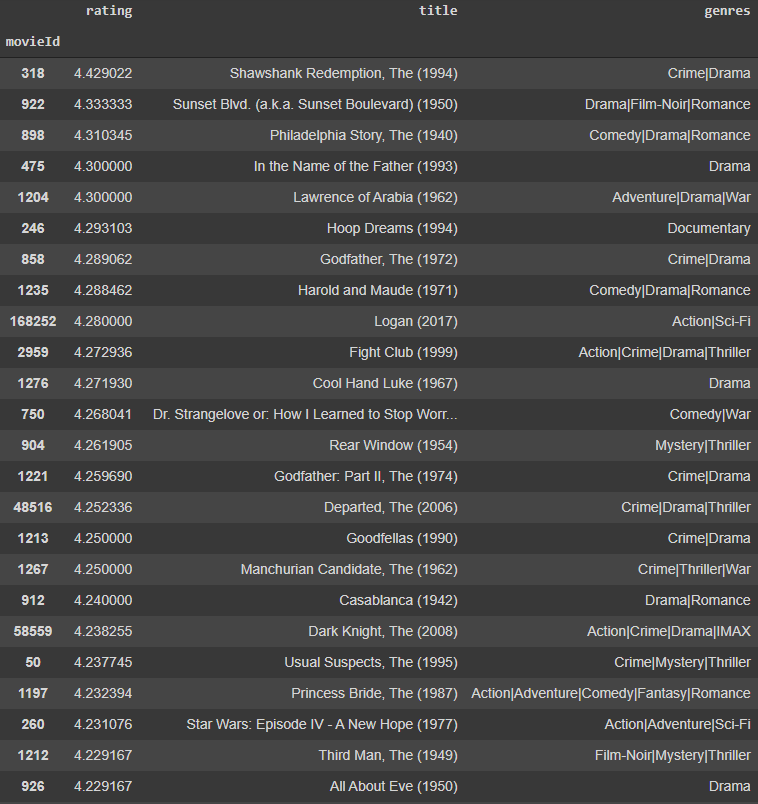
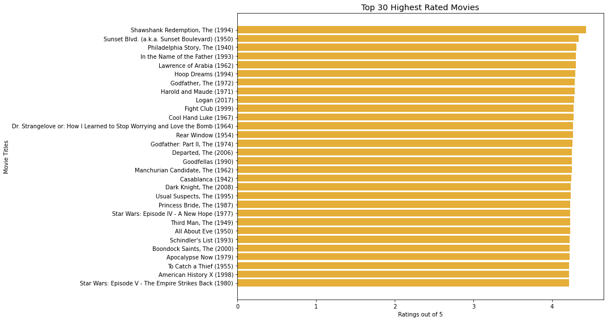
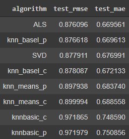
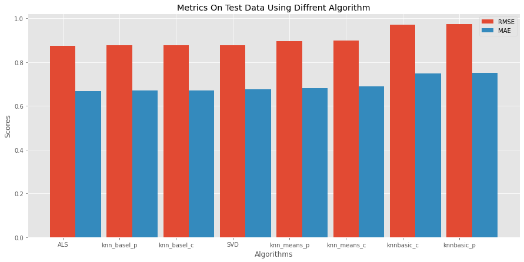
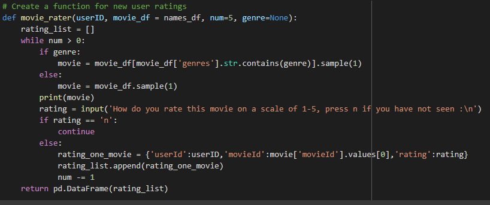
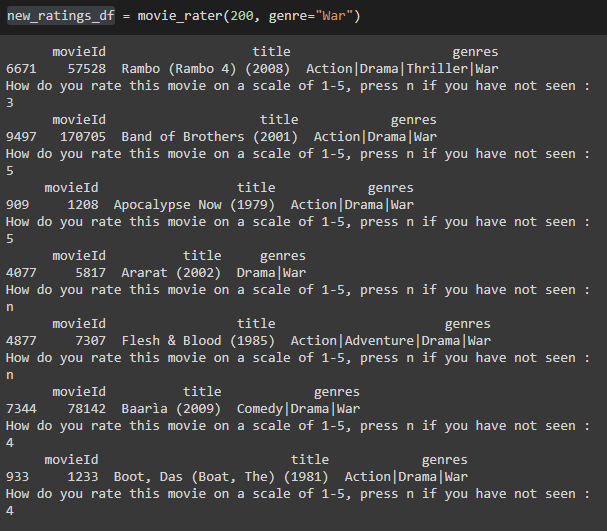
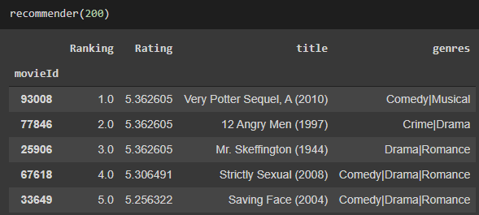
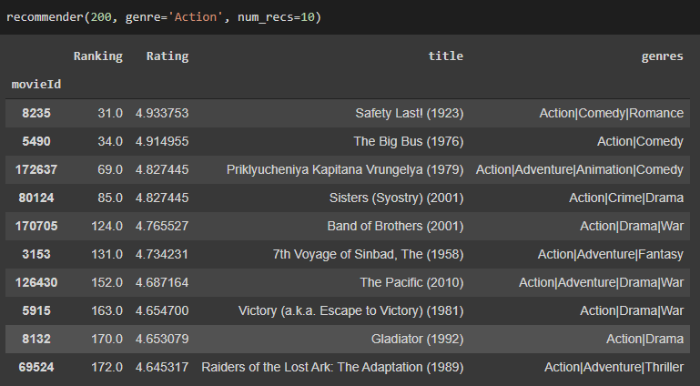
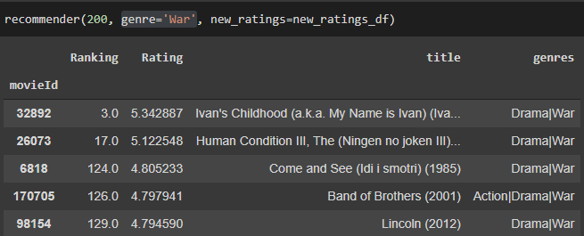

# Project 4 - Movie Recommendation Systems

In this project I will be building a movie recommendation system that will return top recommendations for a user.

### Repository Files
The following are folders and files you can find in this repository and their description

1. content

        1.links.csv      - imdb and tmdb movie links. Is not used in this project

        2.movies.csv     - movie titles and genres

        3.ratings.csv    - the ratings dataset. Contains 4 columns of userId, movieId, rating, and timestamp(Which is dropped).

        4.tags.csv       - movie tags
        
        5. README        - description of the datasets and columns. 

    
 2. images            - images used in this README.md

 3. README.md         - discription of the project and repository

 4. presentation.pdf  - pdf of a PowerPoint presentation meant for a non-technical audience
 
 ### The Data
The data that I worked with is the MovieLens dataset provided by the GroupLens research lab at the University of Minnesota. I had the option of working with the whole dataset or a smaller subset. I chose to work with the smaller dataset in order to save computational time.
 
 ### Process
 
For this project, I undertook an iterative method. I built multiple recommendation systems using different methods and comparing their metrics before settling on a model and then building a recommender.

The Methods that I considered were-

1. Unpersonalized Recommendations
2. Content-Based Recommendations
3. Collaborative Filtering
    - Memory-Based/ K-Nearest Neighbour
        - KNN Basic 
        - KNN with Means - Similar to KNN Basic but the user average ratings is considered
        - KNN with Baseline - A bias term is added to the cost function
    - Model-Based/ Matrix Factorization
        - SVD
        - ALS
    
I made use of GridSearchCV to search out the best values for the parameters. For the metrics comparison, I used RMSE and MAE.

## Unpersonalized Recommendation

First I ranked the movies in order of their average ratings. There were a few movies in the dataset that had only one or two votes given but had 5 stars. I considered these as outliers and in order to get rid of them, I put a limit of at least 20 votes given and ended up with the list below.

These are all critically acclaimed and well known movies. A list like this might be helpful for users who want to know the most popular movies but fail to recommend for a more specific taste. For that, a personalized recommender is needed.

## Personalized Recommendation

After building several memory-based and model-based systems, I ended up with the RMSE scores below.

The RMSE for the KNN with Baseline models and matrix factorization models were so close that the ranking changes with the random draw of the cross-validation. In the ended I decided to go with a matrix factroization model because I know that it scales much better with larger dataset. If I wanted to use the recommender on the larger dataset, it could easily be achieved using this model. Between ALS and SVD, I decided to go with ALS despite it being less efficient because I know that it deals with large, sparse matrices better. If we wanted to add new users to the datasets, their information would be very sparse, so ALS is better for this project.

### Dealing with the "cold start problem"

One of the issues with collaborative filtering is the "cold start problem", which means that with no information on a new user it is impossible to make a recommendation for the person. The method that I dealt with this is by building a function that asks users to give ratings to movies in the database, and then return a pandas dataframe that can be passed into the final recommender.

The number of ratings the user wants to make and the genre of the movies can be specified. For movies the user haven't seen, "n" can be entered to get another movie to rate.

## The Final Model - Hybrid Recommender

The final recommender I build can be considered as a hybrid recommender since you can search out recommendations by genre also. The recommender is in the form of a function that takes in six parameters but only the userId is required to get back an output. By default, the recommender gives back out the top recommendations from all genres, but the genre and number of recommendation can be specified.

The function also takes in the pandas dataframe that is returned from the "movie_rater" function above. The new ratings are combined with the old dataset before the predicted ratings are calculated. 

Here you can see three instances of the recommender in action.

### Improvements

The improvements that I could make to the systems includes

- Make use of the tags datas provided to create a more in depth content based system.

- Use the larger dataset from MovieLens to build the models.

- Configure the code so that movies already rated by the user are not returned in the recommendations.

